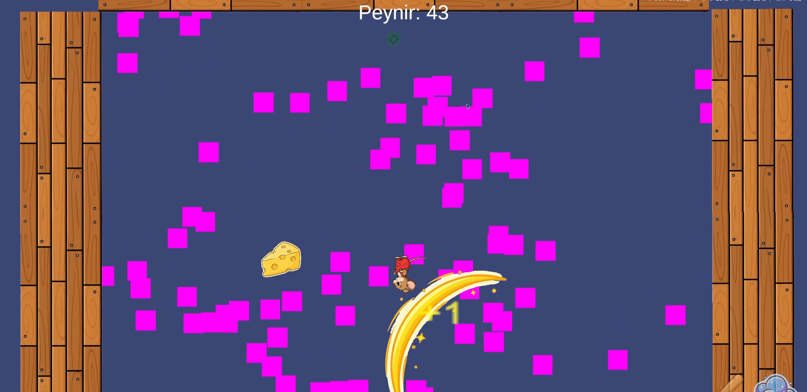

# 🧀 Cheese Hunter

An exciting 2D platform game! Collect cheese while escaping from cats, buy powerful abilities, and try to reach the mouse hole!

## 🎬 Gameplay Video

[](https://youtu.be/3dSSY1YgsLw)

**[🎮 Watch Full Gameplay on YouTube](https://youtu.be/3dSSY1YgsLw)**

*Experience the exciting world of Cheese Hunter! See how to collect cheese, escape from cats, and use powerful abilities in action.*

## 🎮 About the Game

Cheese Hunter is a fun survival game developed with Unity. The player, as a mouse, collects cheese while escaping from cats, purchases powerful abilities from the market system, and ultimately tries to win the game by reaching the mouse hole.

## ✨ Features

### 🎯 Core Gameplay
- **Dynamic Movement**: Move with A/D keys, change gravity with Space
- **Cheese Collection**: Collect randomly spawned cheese on the map
- **Cat Hazards**: Escape from cats
- **Mouse Hole**: Win by reaching the hole that spawns at certain cheese counts

### 🛒 Market System
- **Dynamic Market**: Auto-spawns at specific cheese thresholds
- **5 Different Abilities**:
  - 🏃 **Speed Boost** (10 cheese) - Move 50% faster
  - 🥄 **Stick** (15 cheese) - Destroy all cats (with cooldown)
  - 🌟 **Teleport** (20 cheese) - Teleport to mouse cursor location
  - 🧲 **Buff Magnet** (25 cheese) - Buffs are attracted to you
  - 🗺️ **Map Expansion** (30 cheese) - Expand the game area
- **4 Different Buffs**:
  - ✖️ **Cheese Multiplier** - Earn 1.2x cheese
  - 🛡️ **Invincibility** - 5 seconds of temporary damage immunity
  - ⏰ **Slow Motion** - 5 seconds of slowed time
  - ⏰ **Speed Motion** - 5 seconds of accelerated time

### 🎨 Visual and Audio
- **Dynamic Texture System**: Automatic texture generation
- **Particle Effects**: Cheese collection, death, and buff effects
- **Audio System**: Comprehensive sound effects and music
- **UI System**: Score, abilities, and game state display

### 🤖 Difficulty System
- **Difficulty Scaling**: Increasing difficulty based on cheese count
- **Cat Abilities**:
  - 30+ cheese: Wall bouncing
  - 40+ cheese: Player targeting
  - 60+ cheese: Double bouncing
  - 70+ cheese: Following behavior
  - 80+ cheese: Speed increase
  - 100+ cheese: Super cat (all abilities)
  - 120+ cheese: Elite following

### 🎁 Buff System
- **Random Buffs**: Temporary power-ups spawning on the map
- **Invincibility Buff**: Temporary damage immunity
- **Magnet Effect**: Automatic attraction with buff magnet ability

## 🎮 Controls

| Key | Action |
|-----|---------|
| **A/D** | Move left/right |
| **Space** | Change gravity |
| **E** | Use stick (after purchase) |
| **Left Click** | Teleport (after purchase) |
| **ESC** | Pause game |

## 🏗️ Technical Features

### 🔧 Development
- Developed with **Unity 6000.2.10f1**
- Written with **C# Scripting**
- Designed with **Modular Architecture**

### 📁 Project Structure
```
Assets/
├── Scripts/
│   ├── Core/           # Main game managers
│   ├── Player/         # Player controls and abilities
│   ├── Entities/       # Game objects (Cat, Cheese, etc.)
│   ├── Spawners/       # Spawn systems
│   ├── Market/         # Market and upgrade system
│   ├── UI/            # User interface
│   ├── Effects/       # Visual effects and audio
│   └── Utilities/     # Helper classes
├── Scenes/            # Game scenes
├── Prefabs/           # Prefab objects
└── Materials/         # Materials and textures
```

### 🎯 Main Systems

#### GameManager
- Game state management
- Score and cheese tracking
- Scene transitions
- System coordination

#### Spawner System
- **BaseSpawner**: Basic spawn logic
- **CollectibleSpawner**: Cheese spawning
- **HazardSpawner**: Cat spawning
- **MarketSpawner**: Market spawning
- **BuffSpawner**: Buff spawning
- **MouseHoleSpawner**: Mouse hole spawning

#### AI System
- **DifficultyManager**: Difficulty scaling
- **Cat AI**: Advanced cat behaviors
- **Chance-based Abilities**: Probability-based ability system

#### Audio/Visual
- **AudioManager**: Audio management
- **VFXManager**: Visual effects management
- **TextureManager**: Dynamic texture generation

## 🚀 Installation and Running

### Installation
1. Open the project in Unity Hub
2. Load the `MainMenu` scene in Unity Editor
3. Press the Play button and start playing!

### Building
1. File > Build Settings
2. Select platform (Windows, Mac, Linux)
3. Press Build button
4. Choose output folder and wait

## 🎯 Game Strategies

### 🥇 Beginner Strategy
1. **Collect the first 10 cheese** quickly
2. **Buy speed boost** (critical for survival)
3. Collect more cheese while escaping from cats

### 🏆 Intermediate Level
1. **Get the stick ability** (15 cheese) - use in emergencies
2. **Get teleport** (20 cheese) - perfect for escaping
3. **Get buff magnet** (25 cheese) - automatically collect buffs

### 👑 Advanced Level
1. **Get map expansion** (30 cheese) - more space to maneuver

Note: **Invincibility**, **Cheese multiplier**, **Slow motion** - Earn by collecting buffs

### 💡 Pro Tips
- Use gravity change strategically
- Learn cat spawn points
- Calculate market spawn timings
- Don't miss buffs - they're very valuable!
- When mouse hole appears, decide to take risks or play safe

## 🏅 Achievements and Goals

- **First Escape**: Reach the mouse hole for the first time
- **Cheese Collector**: Collect 50 cheese
- **Survival Expert**: Collect 100 cheese
- **Market Master**: Purchase all abilities
- **Cat Hunter**: Destroy 50 cats with stick
- **Teleport Master**: Use teleport 100 times

## 🎉 Thanks

Thanks to everyone who plays this game! Hope you have fun...

---

**🧀 Good luck! Don't forget to escape from the cats! 🐱**